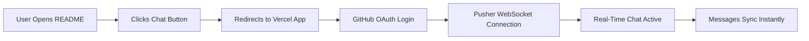

<div align="center">

# 💬 GIT LIVE CHAT


[](https://github.com/JustLachin/git-live-chat/stargazers)
[](https://git-live-chat.vercel.app)
[](LICENSE)

</div>

---

## 🚀 LIVE CHAT WIDGET

<div align="center">


**👆 Real-time chat! Sign in to send messages!**

</div>

---

## ⚡ FEATURES

<table>
<tr>
<td width="50%">

### 🎯 Core Features
- ✅ **GitHub OAuth** - Instant login with GitHub
- ✅ **Real-time messaging** - Pusher WebSocket
- ✅ **Auto avatars** - From your GitHub profile
- ✅ **Online counter** - See active users
- ✅ **No message limit** - Chat freely
- ✅ **Mobile responsive** - Works everywhere
- ✅ **Clean design** - Minimal & professional

</td>
<td width="50%">

### 🛠️ Tech Stack
- ⚛️ **Next.js 14** - React framework
- 🔐 **NextAuth.js** - GitHub OAuth
- 📡 **Pusher Channels** - WebSocket real-time
- 🎨 **TailwindCSS** - Styling
- ☁️ **Vercel** - Deployment
- 🐙 **GitHub API** - User authentication

</td>
</tr>
</table>

---

## 📊 REPOSITORY STATS

<div align="center">


</div>

---

## 🎬 HOW IT WORKS



---

## 🔧 LOCAL SETUP

Want to run this locally or deploy your own version? Follow these steps:

### 1️⃣ Clone Repository

```bash
git clone https://github.com/JustLachin/git-live-chat.git
cd git-live-chat
npm install
```

### 2️⃣ Configure Pusher

1. Create account at [pusher.com](https://pusher.com)
2. Create new **Channels** app
3. Select cluster (e.g., `eu` for Europe, `us2` for US)
4. Copy credentials from **App Keys** tab

### 3️⃣ Configure GitHub OAuth

1. Go to [GitHub Developer Settings](https://github.com/settings/developers)
2. Click **New OAuth App**
3. Fill in details:
   - **Application name**: `Git Live Chat`
   - **Homepage URL**: `http://localhost:3000`
   - **Authorization callback URL**: `http://localhost:3000/api/auth/callback/github`
4. Click **Register application**
5. Copy **Client ID** and generate **Client Secret**

### 4️⃣ Environment Variables

Create `.env.local` file in root directory:

```env
# Pusher Configuration
PUSHER_APP_ID=your_app_id
PUSHER_KEY=your_key
PUSHER_SECRET=your_secret
PUSHER_CLUSTER=eu

# Public Keys (Client-side)
NEXT_PUBLIC_PUSHER_KEY=your_key
NEXT_PUBLIC_PUSHER_CLUSTER=eu

# GitHub OAuth
GITHUB_ID=your_github_client_id
GITHUB_SECRET=your_github_client_secret
NEXTAUTH_URL=http://localhost:3000
NEXTAUTH_SECRET=generate_random_32_char_string
```

**Generate NEXTAUTH_SECRET:**
```bash
# On Linux/Mac
openssl rand -base64 32

# On Windows (PowerShell)
# Use any random 32+ character string
```

### 5️⃣ Run Development Server

```bash
npm run dev
```

Open [http://localhost:3000](http://localhost:3000) in your browser.

---

## 🌐 DEPLOY TO VERCEL

<div align="center">

[](https://vercel.com/new/clone?repository-url=https://github.com/JustLachin/git-live-chat)

</div>

### Manual Deploy Steps:

1. **Install Vercel CLI:**
```bash
npm i -g vercel
```

2. **Deploy:**
```bash
vercel
```

3. **Add Environment Variables in Vercel Dashboard:**
   - Go to your project settings
   - Navigate to **Environment Variables**
   - Add all variables from `.env.local`
   - Update `NEXTAUTH_URL` to your production URL (e.g., `https://your-app.vercel.app`)

4. **Update GitHub OAuth:**
   - Go back to your GitHub OAuth App settings
   - Add production callback URL: `https://your-app.vercel.app/api/auth/callback/github`

---

## 🎨 CUSTOMIZATION

### Change Theme Colors

Edit `app/page.js` and modify the className values:

```javascript
// Current: Black & White theme
className="bg-gray-900 text-white"

// Change to your colors:
className="bg-blue-600 text-white"
className="bg-purple-600 text-white"
```

### Modify Message Limit

Currently set to 5000 characters. Edit `app/page.js`:

```javascript
maxLength={5000}  // Change this value
```

### Change Channel Name

Edit `app/page.js` and `app/api/` files:

```javascript
const channel = pusher.subscribe('github-chat')  // Change 'github-chat'
```

---

## � PROJECT STRUCTURE

```
git-live-chat/
├── app/
│   ├── api/
│   │   ├── auth/[...nextauth]/route.js  # GitHub OAuth handler
│   │   ├── messages/route.js             # Send message endpoint
│   │   └── join/route.js                 # User join endpoint
│   ├── layout.js                         # Root layout
│   ├── page.js                           # Main chat interface
│   ├── providers.js                      # Session provider
│   └── globals.css                       # Global styles
├── .env.local                            # Environment variables (gitignored)
├── .env.example                          # Environment template
├── package.json                          # Dependencies
├── next.config.js                        # Next.js config
├── tailwind.config.js                    # Tailwind config
└── README.md                             # This file
```

---

## 🔒 SECURITY

- ✅ GitHub OAuth for authentication
- ✅ Environment variables for secrets
- ✅ HTTPS only in production
- ✅ No passwords stored
- ✅ Secure WebSocket connections

---

## 🤝 CONTRIBUTING

Contributions are welcome! Here's how:

1. **Fork** the repository
2. **Create** feature branch: `git checkout -b feature/amazing-feature`
3. **Commit** changes: `git commit -m 'Add amazing feature'`
4. **Push** to branch: `git push origin feature/amazing-feature`
5. **Open** Pull Request

---

## 📝 ENVIRONMENT VARIABLES REFERENCE

| Variable | Description | Required | Example |
|----------|-------------|----------|---------|
| `PUSHER_APP_ID` | Pusher application ID | ✅ Yes | `1234567` |
| `PUSHER_KEY` | Pusher key | ✅ Yes | `a1b2c3d4e5f6` |
| `PUSHER_SECRET` | Pusher secret | ✅ Yes | `secret123` |
| `PUSHER_CLUSTER` | Pusher cluster region | ✅ Yes | `eu`, `us2`, `ap1` |
| `NEXT_PUBLIC_PUSHER_KEY` | Public Pusher key | ✅ Yes | Same as `PUSHER_KEY` |
| `NEXT_PUBLIC_PUSHER_CLUSTER` | Public cluster | ✅ Yes | Same as `PUSHER_CLUSTER` |
| `GITHUB_ID` | GitHub OAuth client ID | ✅ Yes | `Iv1.a1b2c3d4e5f6` |
| `GITHUB_SECRET` | GitHub OAuth secret | ✅ Yes | `secret123abc` |
| `NEXTAUTH_URL` | Application URL | ✅ Yes | `http://localhost:3000` |
| `NEXTAUTH_SECRET` | Random secret key | ✅ Yes | 32+ char random string |

---

## 🐛 TROUBLESHOOTING

### Chat not connecting?
- Check Pusher credentials in `.env.local`
- Verify Pusher cluster matches your app
- Check browser console for errors

### GitHub login not working?
- Verify GitHub OAuth callback URL
- Check `GITHUB_ID` and `GITHUB_SECRET`
- Ensure `NEXTAUTH_URL` matches your domain

### Messages not sending?
- Check Pusher dashboard for connection status
- Verify API routes are working
- Check network tab in browser DevTools

---

## 📄 LICENSE

MIT License - see [LICENSE](LICENSE) file for details.

---

## 🔗 LINKS

<div align="center">

[](https://justlachin.dev)
[](https://github.com/JustLachin)
[](https://twitter.com/JustLachin)

</div>

---

## 💡 INSPIRATION

This project was inspired by the need for a simple, embedded chat solution that works directly in GitHub README files. Perfect for:

- 🎓 Open source project discussions
- 👥 Community engagement
- 💬 Real-time collaboration
- 🚀 Portfolio projects
- 📚 Educational purposes

---

<div align="center">

### ⭐ STAR THIS REPO IF YOU LIKE IT! ⭐


**Made with 🔥 by [JustLachin](https://github.com/JustLachin)**

**🐺 The wolf runs alone — but always leaves the door open for the right pack.**

</div>
